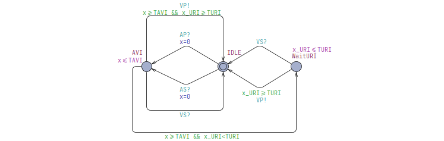

# CS705 Assignment 1 - DDD Pacemaker Mode UPPAAL Model and Verification

Our task is to create a model of DDD mode pacemaker using UPPAAL. The created model shall be 
verified using UPPAAL.

**Timing Constants**:
``` c
const int AEI = 800; 
const int AVI = 150; 
const int VRP = 150; 
const int PVARP = 100; 
const int URI = 400; 
const int LRI = AEI + AVI;
```

## Modelling
Use UPPAAL to build a DDD mode pacemaker to deliver treatments conforming to the timing constraints.


### Atrial Escape Interval (AEI)

### Lower Rate Interval (LRI)


### Upper Rate Interval (URI)


### Atrio-Ventricular Interval (AVI)
A-V Interval


### Post Ventricular Atrial Refractory Period (PVARP)
Minimum V-A Interval


### Ventricular Refractory Period (VRP)
Minimum V-V Interval.


## Verification
Perform the verification of the following properties on the closed-loop system, composed of the heart model, the DDD mode pacemaker and monitors.

### 1. Deadlock
System is deadlock free, and verified using query `A[] not deadlock`.

### 4. Atrial Escape Interval (AEI) Monitor


### 7. Lower Rate Interval (LRI) Monitor


### 6. Upper Rate Interval (URI) Monitor


### 5. Atrio-Ventricular Interval (AVI) Monitor


### 3. Post Ventricular Atrial Refractory Period (PVARP) Monitor


### 2. Ventricular Refractory Period (VRP) Monitor


### 8. `VP!`, where the time interval between this VP and its preceding atrial event is greater than AVI


