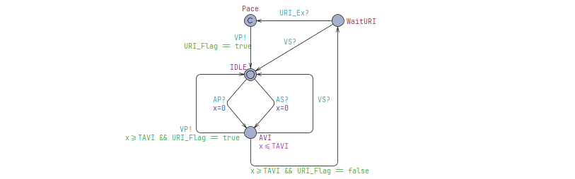

# CS705 Assignment 1 - DDD Pacemaker Mode UPPAAL Model and Verification

Our task is to create a model of DDD mode pacemaker using UPPAAL. The created model shall be verified using UPPAAL.

## Modelling
Use UPPAAL to build a DDD mode pacemaker to deliver treatments conforming to the timing constraints.


*Figure 1: DDD Pacemaker Mode Timing Diagram*

**Timing Constants**:
``` c
const int AEI = 800; 
const int AVI = 150; 
const int VRP = 150; 
const int PVARP = 100; 
const int URI = 400; 
const int LRI = AEI + AVI;
```
**Global Declarations**:
``` c
// Place global declarations here.
// random atria and ventricle bounds
const int Vmaxwait = 1000;
const int Vminwait = 300;
const int Amaxwait = 1000;
const int Aminwait = 300;

// given timing constraints
const int TAEI = 800; // atrial escape period
const int TAVI = 150; // atrio ventricular interval 
const int TVRP = 150; // ventricular refract. period
const int TPVARP = 100; // post ventricular atrial refract. preiod
const int TURI = 400; // upper rate interval
const int TLRI = TAEI + TAVI; // lower arte interval

// URI clock
clock x_URI = 0;
```
**System Declaration**:
``` c
// Declaration goes here.
broadcast chan VSense, ASense, VS, AS, VP, AP;

// Place template instantiations here.
// random heart models
Random_Ventricle = RV(VSense, VP);
Random_Atria = RA(ASense, AP);

// ddd timing controllers
Con_AEI = AEI(AP, AS, VP, VS);
Con_VRP = VRP(VS, VSense, VP);
Con_AVI = AVI(VP, VS, AS, AP);
Con_URI = URI(VP, VS);
Con_PVARP = PVARP(AS, ASense, VS, VP);

// Monitors for ddd timing verification
Monitor_LRI = LRI_Monitor(VS, VP);
Monitor_URI = URI_Monitor(VS, VP);
Monitor_AVI = AVI_Monitor(VS, VP, AS, AP);
Monitor_AEI = AEI_Monitor(VS, VP, AS, AP);
Monitor_VRP = VRP_Monitor(VS, VP);
Monitor_PVARP = PVARP_Monitor(VS, VP, AS, AP);

// List one or more processes to be composed into a system.
system Random_Ventricle, Random_Atria, Con_AEI, Con_VRP, Con_AVI, Con_URI, Con_PVARP, Monitor_LRI, Monitor_URI, Monitor_AVI, Monitor_AEI, Monitor_VRP, Monitor_PVARP;
```

**Random Heart Model (RHM)**
The RHM will be what generates ventricular and atrial events for the uppaal model.


*Figure 2: Random Heart Model*

### General Overview
The denoted suffix '-Sense' are the events read from the heart by the pacemaker, and the denoted suffix '-S' are the filtered events from the heart by VRP and PVARP.

I opted to use the local clocks with the controller models, instead of modelling a timer and a controller separate (like in the given VVI_nodelay example). When using a local clock and controller together, we can avoid using event flags and additional commited syncing nodes for the models. With additional conditional event flags/ logic and syncing states required, it makes deadlocks harder to find and debug. Additionally, we can minimise the number of broadcast channels in the system to 6 — VSense, ASense, AS, VS, AP, and VP. 
e.g. When using a broadcast chan `URI_Ex` and event flag `bool URI_Flag`  instead of a global clock for URI to control and AVI to read — additional states, broadcast channel, and flags are needed for AVI and URI to operate under the timing conditions in sync. Examples shown in Figure 3 and 4.

 

*Figure 3 and 4: AVI and URI example using flag*

All models contain and use their own local clocks, with URI being the one exception as AVI needs to know if the URI clock has surpassed TURI. State invariants and transition guards are crucial to ensure transitions and condtions are fufilled within the timing constraints.

There is no explicit LRI model, as LRI is defined as `TLRI = TAEI + TAVI`, meaning AEI and AVI handle LRI given that they operate within the set timing constraints — i.e. After a ventricular event if there is no atrial event sensed (AS), AEI paces the atrial chamber when reaching TAEI, AVI moves into 'AVI' waiting state and will pace the ventricular chamber after TAVI. This means the V-V Interval will be `AEI + AVI`. This ensures that no two ventricular events ever exceed LRI.

### Atrial Escape Interval (AEI)
The AEI component ensures that if no atrial event is sensed (AS?) or ventricular pacing occurs (VP?) within the atrial escape interval (TAEI), the pacemaker triggers an atrial pacing event (AP!). The clock resets with each atrial or ventricular event. If the  exceeds TAEI, the model transitions to an atrial pacing state.

Output: `AP!`


*Figure 5: AEI Model*

### Upper Rate Interval (URI)
Measures interval after ventricular event with global clock.


*Figure 6: URI Model*

### Atrio-Ventricular Interval (AVI)
The AVI controls the A-V interval. If no ventricular event is sensed (VS?), after an atrial event within the atrioventricular interval (TAVI), the AVI triggers a ventricular pacing event (VP!). If the global URI clock hasn't been exceeded TURI, it will wait until it has in WaitURI state.

Output: `VP!`


*Figure 7: AVI Model*

### Post Ventricular Atrial Refractory Period (PVARP)
The PVARP ensures that after a ventricular event (VS or VP), the atrium enters a refractory period where atrial events are ignored to prevent inappropriate responses to retrograde conduction. No atrial events are allowed until the clock exceeds TPVARP in the PVARP state, after which it returns to IDLE state in which atrial events can be sensed (ASense -> AS). ASSensed is a commited state to prevent time from passing and transition immediately.

Output: `AS!`


*Figure 8: PVARP Model*

### Ventricular Refractory Period (VRP)
The VRP ensures that after a ventricular event (VS or VP), the ventricle enters a refractory period during which any following ventricular events are ignored to prevent inappropriate pacing or sensing due to premature ventricular contractions. During the VRP state, no further ventricular events are recognized until the clock exceeds TVRP. After it returns to IDLE state in which ventricular events can be sensed (VSense -> VS). VSSensed is a commited state to prevent time from passing and transition immediately.

Output: `VS!`


*Figure 9: VRP Model*

## UPPAAL Verification


### Results


*Figure 10 and 11: Verification Query Results - comments, queries*

### 1. Deadlock
System is deadlock free, and verified using the 'for all paths and at all times' operator `A[]`.
```
A[] not deadlock
```

### 2. Ventricular Refractory Period (VRP) Monitor
Monitor starts timer after a ventricular event, and snapshots the 'V-VS' Interval by moving into 'VSSensed' state when `VS` is detected.

Using 'for all paths and at all times' operator `A[]`, after a ventricular event, following ventricular events are not sensed within VRP.
```
A[] (Monitor_VRP.VSSensed imply Monitor_VRP.t >= TVRP)
```


*Figure 12: VRP Monitor Model*

### 3. Post Ventricular Atrial Refractory Period (PVARP) Monitor
Monitor starts timer after a ventricular event, and snapshots the 'V-AS' Interval by moving into 'ASSensed' state when `AS` is detected. If instead `AP` is detected, it restarts from the next ventricular event.

Using 'for all paths and at all times' operator `A[]`, after a ventricular event, atrial events are not sensed within PVARP.
```
A[] (Monitor_PVARP.ASSensed imply Monitor_PVARP.t >= TPVARP)
```


*Figure 13: PVARP Monitor Model*

### 4. Atrial Escape Interval (AEI) Monitor
Monitor starts timer after a ventricular event, and snapshots the 'V-AP Interval' by moving into 'APDetected' state when `AP` is detected. If instead `AS` is detected after a ventricular event, it restarts from the next ventricular event.

Using 'for all paths and at all times' operator `A[]`, after a ventricular event, the pace maker cannot pace the atrial chamber within AEI.
```
A[] (Monitor_AEI.APDetected imply Monitor_AEI.t >= TAEI)
```


*Figure 14: AEI Monitor Model*

### 5. Atrio-Ventricular Interval (AVI) Monitor
Monitor starts timer after a ventricular event, and snapshots the 'A-VP Interval' by moving into 'VPDetected' state when `VP` is detected. If instead `VS` is detected after an atrial event, it restarts from the next atrial event.

Using 'for all paths and at all times' operator `A[]`, after an atrial event, the pacemaker cannot pace the ventricle chamber within AVI.
```
A[] (Monitor_AVI.VPDetected imply Monitor_AVI.t >= TAVI)
```


*Figure 15: AVI Monitor Model*

### 6. Upper Rate Interval (URI) Monitor
Monitor starts timer after a ventricular event, and snapshots the 'V-VP Interval' by moving into 'VPDetected' state when `VP` is detected. If instead `VS` is detected, it just restarts the timer.

Using 'for all paths and at all times' operator `A[]`, after a ventricular event, the pacemaker cannot pace the ventricle chamber within URI.
```
A[] (Monitor_URI.VPDetected imply Monitor_URI.t >= TURI)
```


*Figure 16: URI Monitor Model*

### 7. Lower Rate Interval (LRI) Monitor
Monitor starts timer after a ventricular event, and snapshots the 'V-V Interval' by moving into 'VDetected' state when a ventricular event occurs `VS` or `VP`. After the following ventricular event occurs, it restarts the timer.

Using 'for all paths and at all times' operator `A[]`, that any two ventricular events is less than or equal to LRI.
```
A[] (Monitor_LRI.VDetected imply Monitor_LRI.t <= TLRI)
```


*Figure 17: LRI Monitor Model*

### 8. `VP!`, where the time interval between this VP and its preceding atrial event is greater than AVI
Reusing the AVI Monitor, but using the 'there exist eventually' operator `E<>` for when `VP` is detected, and the timer is greater than AVI. This ensures that there is a path where the interval between this VP and its preceding atrial event (A-VP Interval) is greater than AVI.

```
E<> (Monitor_AVI.VPDetected imply Monitor_LRI.t > TAVI)
```

*end.*