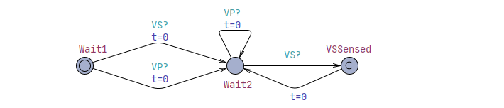
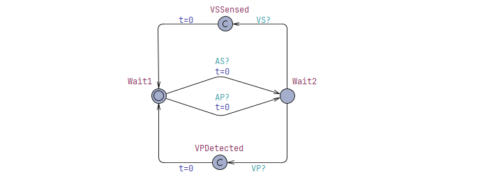
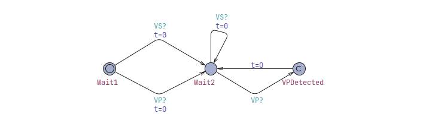

# CS705 Assignment 1 - DDD Pacemaker Mode UPPAAL Model and Verification

Our task is to create a model of DDD mode pacemaker using UPPAAL. The created model shall be verified using UPPAAL.

## Modelling
Use UPPAAL to build a DDD mode pacemaker to deliver treatments conforming to the timing constraints.


*Figure 1: DDD Pacemaker Mode Timing Diagram*

**Timing Constants**:
``` c
const int AEI = 800; 
const int AVI = 150; 
const int VRP = 150; 
const int PVARP = 100; 
const int URI = 400; 
const int LRI = AEI + AVI;
```

### Lower Rate Interval (LRI) and Atrial Escape Interval (AEI)
**LRI**, the maximum time interval between two consecutive ventricular events. In dual chamber mode, LRI time interval equals the summation of AVI and AEI. It serves as the lower bound for the heart rate, and hence the value of LRI is greater than URI.
**AEI**, the maximum time interval between a ventricular event and the corresponding atrial event.


*Figure 2: LRI Model*

### Upper Rate Interval (URI)
**URI**, the minimum time interval between two consecutive ventricular events.


*Figure 3: URI Model*

### Atrio-Ventricular Interval (AVI)
**AVI**, the maximum time interval between an atrial event and the corresponding ventricular event. 


*Figure 4: AVI Model*

### Post Ventricular Atrial Refractory Period (PVARP)
**PVARP**, the resting period for the atrium after each ventricular event. Physiologically, atrial events are not detectable detected by the pacemaker during the resting period. That is, if APulse, generated by the heart model, occurs within PVARP, it will be ignored by the pacemaker. 


*Figure 5: PVARP Model*

### Ventricular Refractory Period (VRP)
**VRP**, the resting period for the ventricle after each ventricular event. Physiologically, ventricular events are not detectable by the pacemaker during the resting period. That is, if VPulse, generated by the heart model, occurs within VRP, it will be ignored by the pacemaker. 


*Figure 6: VRP Model*

## UPPAAL Verification
Perform the verification of the following properties on the closed-loop system, composed of the heart model, the DDD mode pacemaker and monitors.

### Results


*Figure 7 and 8: Verification Query Results*

### 1. Deadlock
System is deadlock free, and verified using the 'for all paths and at all times' operator `A[]`.
```
A[] not deadlock
```

### 2. Ventricular Refractory Period (VRP) Monitor
Using 'for all paths and at all times' operator `A[]`, after a ventricular event, following ventricular events are not sensed within VRP.
```
A[] (Monitor_VRP.VSSensed imply Monitor_VRP.t >= TVRP)
```


*Figure 9: VRP Monitor Model*

### 3. Post Ventricular Atrial Refractory Period (PVARP) Monitor
Using 'for all paths and at all times' operator `A[]`, after a ventricular event, atrial events are not sensed within PVARP.
```
A[] (Monitor_PVARP.ASSensed imply Monitor_PVARP.t >= TPVARP)
```


*Figure 10: PVARP Monitor Model*

### 4. Atrial Escape Interval (AEI) Monitor
Using 'for all paths and at all times' operator `A[]`, after a ventricular event, the pace maker cannot pace the atrial chamber within AEI.
```
A[] (Monitor_AEI.APDetected imply Monitor_AEI.t >= TAEI)
```


*Figure 11: AEI Monitor Model*

### 5. Atrio-Ventricular Interval (AVI) Monitor
Using 'for all paths and at all times' operator `A[]`, after an atrial event, the pacemaker cannot pace the ventricle chamber within AVI.
```
A[] (Monitor_AVI.VPDetected imply Monitor_AVI.t >= TAVI)
```



*Figure 12: AVI Monitor Model*

### 6. Upper Rate Interval (URI) Monitor
Using 'for all paths and at all times' operator `A[]`, after a ventricular event, the pacemaker cannot pace the ventricle chamber within URI.
```
A[] (Monitor_URI.VPDetected imply Monitor_URI.t >= TURI)
```



*Figure 13: URI Monitor Model*

### 7. Lower Rate Interval (LRI) Monitor
Using 'for all paths and at all times' operator `A[]`, that any two ventricular events is less than or equal to LRI.
```
A[] (Monitor_LRI.VDetected imply Monitor_LRI.t <= TLRI)
```


*Figure 14: LRI Monitor Model*

### 8. `VP!`, where the time interval between this VP and its preceding atrial event is greater than AVI
Reusing the AVI Monitor, but using the 'there exist eventually' operator `E<>` for when `VP` is detected, and the timer is greater than AVI.

```
E<> (Monitor_AVI.VPDetected imply Monitor_LRI.t > TAVI)
```

end.